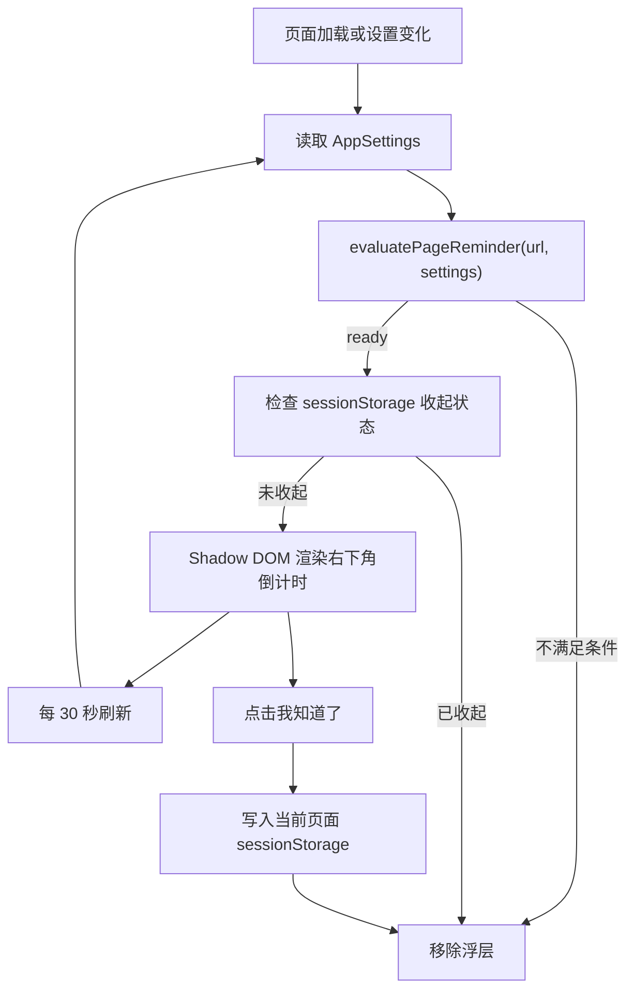

# 提前提醒体验设计

## 背景

`prd.md` 定义了规则组提前提醒：正式限制开始前，插件应提醒用户即将进入限制状态。当前实现同时提供 `chrome.notifications` 系统通知和页面内低刺激浮层，让用户停留在即将被阻断的网站中时也能看见收尾反馈。

提前提醒的目标不是提前阻断，而是让用户在真正越界前有一次安静的收尾机会。

## 体验原则

- **只提醒相关页面**：页面内提醒只出现在命中规则组站点的 `http(s)` 页面；非名单网站继续只依赖系统通知。
- **低刺激，不抢夺控制权**：不使用 `alert()`、全屏遮罩或必须处理的 modal。正式阻断页才是强边界。
- **可见但可忽略**：使用右下角浮层，避开页面主阅读区，用户可以收起。
- **不改变规则状态**：收起浮层只影响当前标签页的当前提醒 session，不关闭通知、不暂停规则、不创建解锁。
- **不记录页面内容**：内容脚本只读取 `window.location.href` 和本地设置，不读取标题、正文、输入内容或浏览历史。

## 触发条件

页面内提醒在以下条件全部满足时出现：

1. 规则组启用，且规则组 schedule 启用。
2. `reminderMinutes > 0`。
3. 当前 URL 是 `http://` 或 `https://`。
4. 当前 host 匹配该规则组的站点规则，包括子域名匹配。
5. 当前时间处于 `[规则开始时间 - reminderMinutes, 规则开始时间)`。
6. 当前尚未进入正式阻断期。
7. 到规则开始时间时，该 host 没有仍然有效的临时解锁。
8. 用户没有在当前标签页当前 session 中收起过该提醒。

多个规则组同时匹配时，页面倒计时必须指向最近一次即将发生的阻断；如果多个规则组开始时间相同，再沿用阻断优先级：`strict > standard > gentle`。

## UI 方案

浮层固定在页面右下角，宽度沿用 Popup 的 `w-80` 语义，不超过 `320px`，在窄屏上使用 `calc(100vw - 32px)`。视觉必须贴近现有 Popup 的实现语言：`bg-white/95` 外壳、`stone-50` 顶栏和底栏、`slate-200` 边框、`shadow-soft` 阴影、居中的 `indigo-50` 图标块、`slate-*` 文本层级和 `indigo-600` 主按钮。不使用深色独立主题，也不使用跳动动画。

内容结构：

- 品牌与规则组：顶部显示 `守界`，正文显示当前规则组名，例如 `"工作时间专注即将开启"`。
- 倒计时：例如 `"10 分钟后进入限制时间"`。
- 收尾提示：说明当前页面即将被该规则组拦下。
- 剩余时间条：浅色 `slate-200` 轨道和柔和 `indigo` 条，表示提醒窗口剩余比例，并在当前刷新周期内平滑缩短到 0，让用户能感受到时间正在流逝。
- 用户承诺语：使用规则组 `commitment`，没有时使用默认晚安文案。
- 当前 host。
- `"我知道了"` 收起按钮。

## 实现边界

- `src/shared/time.ts` 负责提醒窗口时间计算。
- `src/shared/sites.ts` 负责页面内提醒资格判断。
- `src/background/index.ts` 继续负责系统通知、定时扫描和正式阻断。
- `src/content/reminder-overlay.ts` 只负责在页面中展示或移除浮层。
- `public/manifest.json` 通过 `content_scripts` 注入 `assets/reminder-overlay.js`。
- `vite.config.ts` 将内容脚本单独打成 IIFE 自包含文件，避免 MV3 静态 content script 加载共享 ESM chunk 失败。

## Mermaid Flow

## 验证

- `tests/time.test.ts` 覆盖提醒窗口、倒计时剩余时间和跨午夜开始时间。
- `tests/sites.test.ts` 覆盖页面内提醒资格、非名单站点、已阻断状态、重叠规则组和解锁排除。
- `tests/e2e/entrypoints.spec.ts` 覆盖浮层显示、非名单隐藏和收起行为。
