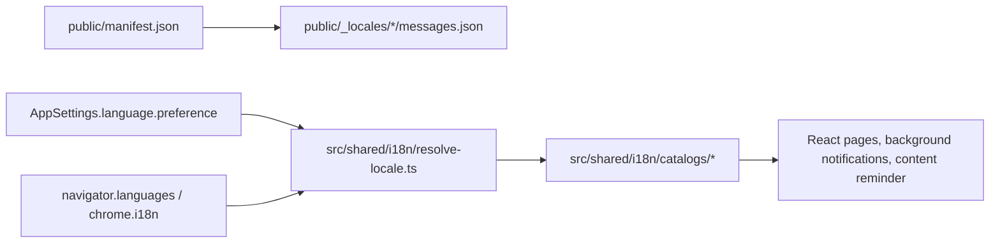

# Runtime Localization

This document is the current maintenance guide for FocusGate / 守界 localization. The historical implementation plan is archived at `project-docs/archive/i18n-plan-2026-06-27.md`; use this file and the source code as the active guidance.

Primary sources of truth:

- Product naming and scope: `prd.md`
- Visual and copy tone: `DESIGN.md`
- Runtime architecture summary: `project-docs/architecture.md`
- Runtime implementation: `src/shared/i18n/`
- Public site localization rules: `docs/AGENTS.md`
- Chrome extension localization model: https://developer.chrome.com/docs/extensions/how-to/ui/localization
- Chrome `i18n` API: https://developer.chrome.com/docs/extensions/reference/api/i18n
- Browser language input: https://developer.mozilla.org/docs/Web/API/Navigator/languages

## Supported Locales

Runtime locale ids use BCP-style strings:

| Runtime locale | Role | Notes |
|---|---|---|
| `zh-CN` | Default locale | The fallback for unsupported languages and the default product voice. |
| `en` | First international locale | English UI copy should be direct and product-oriented, not literal Chinese translation. |

`src/shared/i18n/locales.ts` owns `SUPPORTED_LOCALES`, `DEFAULT_LOCALE`, `LanguagePreference`, and the mapper from runtime locale ids to Chrome locale folders.

`AppSettings.language.preference` stores one of:

| Value | Meaning |
|---|---|
| `auto` | Resolve from the current browser language list and fall back to `zh-CN`. |
| `zh-CN` | Force Simplified Chinese runtime UI. |
| `en` | Force English runtime UI. |

## Two Localization Layers

FocusGate uses separate localization layers because Chrome metadata and runtime UI have different constraints.



Chrome extension metadata lives in `public/_locales/` and is referenced from `public/manifest.json` with `__MSG_...__` placeholders. Chrome folder names use Chrome conventions such as `zh_CN`.

Runtime UI lives in typed TypeScript catalogs under `src/shared/i18n/catalogs/`. Runtime code should use `zh-CN` and `en`, not Chrome folder names.

The public website in `docs/` is a third surface with its own static routing, language switcher, and `hreflang` tags. Do not reuse extension runtime catalogs for public website pages or Chrome Web Store listing copy.

## Runtime Module Map

| File | Responsibility |
|---|---|
| `src/shared/i18n/types.ts` | Defines the typed catalog shape and localized copy contracts. |
| `src/shared/i18n/locales.ts` | Defines supported locales, language preference values, and Chrome folder mapping. |
| `src/shared/i18n/resolve-locale.ts` | Pure language negotiation from preference and browser language candidates. |
| `src/shared/i18n/runtime.ts` | Environment adapters for settings-backed DOM/content/background locale resolution. |
| `src/shared/i18n/react.tsx` | React provider and hook for localized entry points. |
| `src/shared/i18n/catalogs/*.ts` | Locale catalogs for runtime UI, defaults, errors, and formatter strings. |
| `src/shared/i18n/format.ts` | Locale-aware duration, count, weekday, and time helpers. |
| `src/shared/i18n/popup-status.ts` | Localized popup status copy derived from semantic popup state. |
| `src/shared/defaults.ts` | Locale-specific default settings and default rule group creation. |
| `src/shared/block-page.ts` | Locale-specific built-in block-page templates and normalization fallbacks. |

## Language Resolution

Keep `resolveLocale` pure. Environment-specific APIs should only collect input and pass it into the resolver.

Resolution order:

1. If `settings.language.preference` is `zh-CN` or `en`, use that explicit preference.
2. If the preference is `auto`, inspect browser language candidates in order.
3. Match exact runtime locales first, then supported language families such as `zh-*` to `zh-CN` and `en-*` to `en`.
4. Fall back to `DEFAULT_LOCALE` (`zh-CN`).

Context adapters:

| Context | Entry point |
|---|---|
| React pages | Use `I18nProvider` / `useI18n` when the page can render through context. |
| Options page utilities | Use `getLocaleFromSettings(settings)` when logic runs outside the provider. |
| Content reminder | Use `getLocaleFromSettings(settings)` with `navigator.languages`. |
| Background service worker | Use `resolveBackgroundLocale()` for first install defaults and `getBackgroundBrowserLanguages()` for Chrome language APIs. |
| Tests | Call `resolveLocale` directly with explicit language arrays. |

## User Content Boundary

Saved rule-group copy is user content. Language switching must not translate or overwrite these fields:

- Rule group names
- Commitments
- Block-page titles and descriptions
- Primary action labels
- Handoff titles and HTML
- Custom block HTML

Locale-specific defaults are only used for:

- New installs
- New rule groups
- Missing fallback values during normalization
- Import normalization when a settings export is incomplete

If the product later needs to refresh stored default copy into another language, implement it as an explicit user-triggered action. Do not hide it inside language switching or storage migration.

## Settings Transfer

Settings export/import is part of the localized Options surface.

- `src/shared/settings-transfer.ts` exports transferable settings only: rule groups, onboarding state, and language preference.
- Temporary unlocks, reminder session ids, pause state, and stats events are intentionally omitted.
- Import normalization uses a caller-provided locale for missing defaults, but it must preserve stored user copy when present.
- Transfer UI copy and errors live under `options.transfer` in every runtime catalog.

When adding import/export strings, update both catalogs and the Playwright coverage in `tests/e2e/entrypoints.spec.ts` if the visible flow changes.

## Adding Or Changing Runtime Copy

Use this checklist for every user-visible runtime string:

1. Add or update the semantic field in `src/shared/i18n/types.ts`.
2. Update every catalog in `src/shared/i18n/catalogs/`.
3. Prefer formatter functions for variable phrases, plural-like wording, or language-specific word order.
4. Use existing helpers such as `formatDuration`, `formatMinutes`, `formatCount`, `formatWeekday`, and `getPopupStatusCopy` before introducing a new pattern.
5. Keep shared rule logic semantic. Derive localized copy in the i18n layer or in UI entry points that receive a catalog.
6. Add or update tests when copy affects behavior, rendering, defaults, or import/export summaries.
7. If extension metadata changes, update `public/manifest.json` and every `public/_locales/*/messages.json` file together.

Avoid these patterns:

- Hardcoded user-visible strings in React entry points, service worker notifications, or content scripts when a catalog key is appropriate.
- String concatenation for translatable phrases.
- Reusing Chrome `_locales` messages as the runtime catalog.
- Translating saved user-generated rule-group fields during language changes.

## Verification

Run the standard checks before handing off i18n changes:

```bash
npm run typecheck
npm test
npm run test:e2e
npm run build
```

Important coverage points:

- `tests/i18n.test.ts` covers resolver behavior, locale-specific defaults, formatting, and popup status copy.
- `tests/settings.test.ts` covers language backfill without overwriting stored rule-group copy.
- `tests/settings-transfer.test.ts` covers settings export/import normalization and transient-state omission.
- `tests/e2e/entrypoints.spec.ts` covers Options language switching and visible settings transfer behavior.

For manual extension QA, build `dist/`, load it as an unpacked extension, and check that Chrome metadata follows browser UI language while the in-app language selector can override runtime UI language.

## Open Decisions

- Unsupported runtime languages currently fall back to `zh-CN`. Revisit this only when the international launch strategy changes.
- Chrome Web Store listing copy is maintained separately in `project-docs/store/`; do not generate listing text from runtime catalogs.
- There is no current action to rewrite an existing saved rule group into another language. If added, it must be explicit, reversible where practical, and documented in Options copy.
